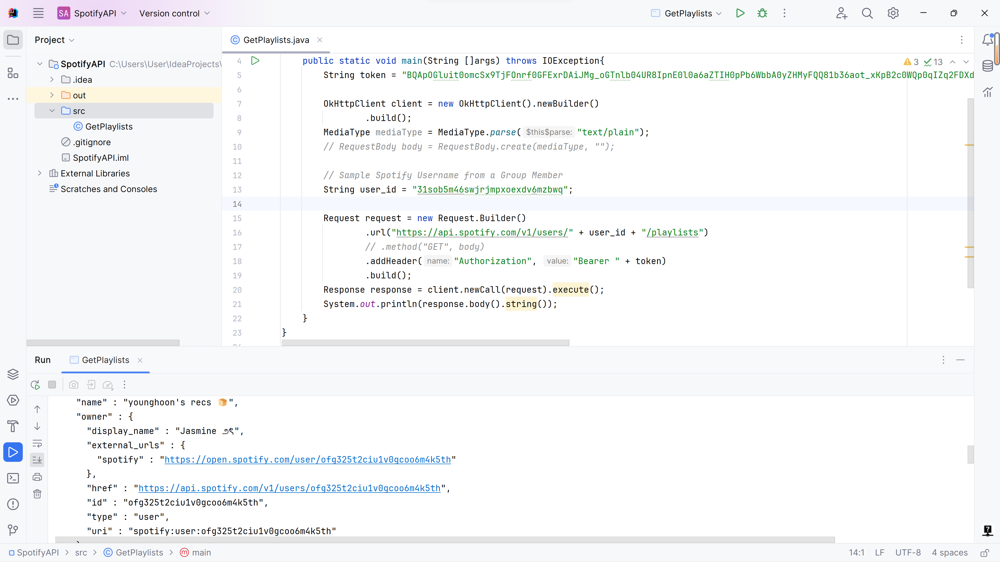

# group-project
Our group will be attempting to build a website for various music features similar to Spotify's Wrapped, that will be accessed from various music streaming APIs. 

The first will be to rank how "underground" your music taste is, based on a user's data from various music streaming platforms. The algorithm design is still TBD, but one metric we could use is the number of views a song has or followers of an artist. 

The second idea will be to create a playlist based on a prompt a user inputs. For example a playlist of all the biggest classic rock songs, or even some lesser known ones. This will be achieved by accessing the tags associated with a song in Spotify's API. 

This second idea will also allow the user to create an Apple Music playlist by accessing the Spotify API to find songs, and just compiling them into an Apple playlist. 

We are still deciding on further ideas to include on the website, but for now, we believe this is a solid website idea that will attract users to our website. Aside from other nice features, we could add specifically for music streaming platforms, we are also looking into possibly building a machine learning algorithm that would allow us to convert musical notation written on paper into a digital format. This is tentative and depending on the complexity + specific instructions on the project, we may or may not develop it. 

Spotify API-1: https://developer.spotify.com/documentation/web-api/reference/get-an-artists-albums 

Here is an example of us using Postman to access Spotify's new releases: 

Here is an example of us running the Java code to access Spotify's API:

Spotify API-2: https://developer.spotify.com/documentation/web-api/reference/get-list-users-playlists

Here is another example of us using Postman to access a Spotify user's playlists:

Here is the sample output of calling the Spotify API based on token generated via PostMan:

[Link to Sample Output File](https://github.com/mehtab0301/group-project/blob/YuxinDuan-README-update/SpotifyAPIGetPlaylistsResponse.json)